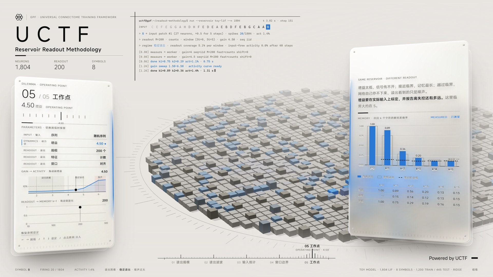

# Reservoir Readout Methodology — interactive demo

An interactive page that shows how much of a reservoir's measured "memory" depends on the **readout and protocol** rather than on the network. Five dilemmas, each measured live in the browser:

| # | Dilemma | What changes |
|---|---|---|
| 01 | Readout size | number of readout neurons M |
| 02 | Readout filter | counts / spike trace / counts + trace / counts + previous window (delay-line control) |
| 03 | Input statistics | random / text-like / text-like shuffled, with the zero-memory baseline |
| 04 | Window boundary | readout window aligned or shifted by 1–2 steps |
| 05 | Operating point | network gain |

The array colours the firing blocks by readout regime, decided live from the network itself:
**readout starved** (grey: fewer than ~2.5 % of readout neurons respond per symbol window),
**stable readout** (blue), **noise dominated** (red: more than ~8 % activity remains after 40 input-free steps).
The thresholds were calibrated offline with `calibration/regimes.py`.

## Run

- **Windows:** double-click `UCTF_Readout.exe`. It unpacks the page to `%TEMP%\uctf_readout` and opens it in an Edge or Chrome app window.
- **Any OS:** open `index.html` in a recent Chrome, Edge or Firefox.

Internet is needed for three.js and the MiSans web font (both loaded from jsDelivr).

URL parameters: `?lang=en&ch=5&gain=6.5&M=120&seq=text&feat=both&shift=1`.

## Controls

- `← →` switch dilemma, `↑ ↓` change the current setting; the tick ruler at the bottom does the same with the mouse.
- Drag the two curves in the left panel (continuous); a measurement runs when you release.
- Click the array to inject a stimulus; drag it to rotate.
- Bottom right: background texture, 中 / EN, dark / light.

## What it is and is not

A **toy model**: 1,804 LIF neurons (dt 20 ms, τ 100 ms, threshold 1, reset 0, tonic 0.05) on a disc, random local wiring (12 targets per neuron), 11.5 % inhibitory, 8 symbols each driving a fixed patch. Memory is ridge decoding of the symbol k steps back (1,200 train / 445 test). The effects match the connectome results qualitatively; the numbers are not connectome numbers.

## Files

- `index.html` — the whole page (simulation, Web Worker measurement, Three.js view).
- `UCTF_Readout.exe` — Windows launcher with the page embedded. Rebuild with `launcher/build.ps1` (uses the C# compiler that ships with Windows).
- `calibration/measure.py`, `calibration/regimes.py` — NumPy versions of the toy model used to check the effects and set the regime thresholds.
